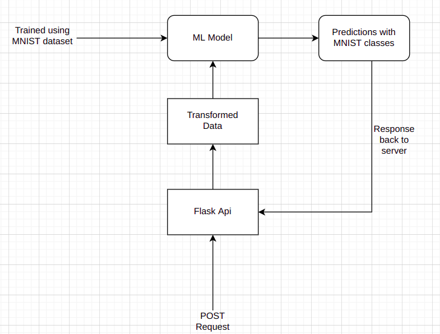

# Cars_mnist
MNIST Dataset ML model Predictions

### Implementation steps

1. Training: The MNIST dataset is loaded and preprocessed. The data is then split into training and testing sets. A deep learning model, such as a convolutional neural network (CNN), is defined and trained on the training set using a framework Keras. The model is then evaluated on the testing set to assess its performance.

2. Serving: The trained model is saved to a file, such as a HDF5 file. A Flask web server is set up and a route is defined to handle predictions. When a request is received, the server loads the trained model from the file and uses it to make predictions on the image sent with the request. The server then sends the prediction results back to the client.

3. The trained model is deployed in the server where the flask application is running, this can be a local server or a cloud server.

4. The client side sends a request to the flask server with an image file, the server loads the model and process the image, then it sends back the prediction to the client.

5. The client can be a web application, mobile application or any other software that can send HTTP request to the flask server.

### ARCHITECTURE

</img>